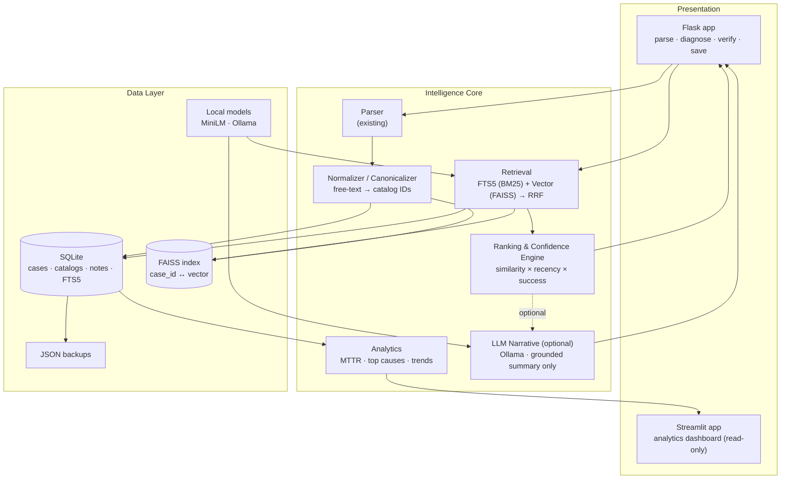
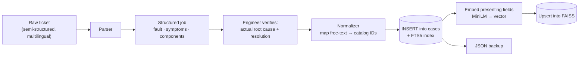
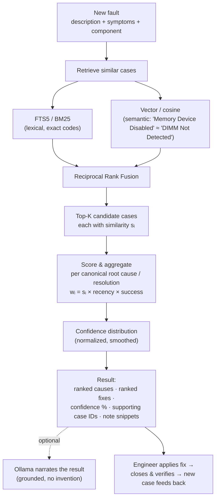

# FIARS → Fault Resolution Intelligence Platform

**Architecture & Design Document**
Evolving FIARS (Fault Intelligence & Auto Report System) from *parse + store* into a
retrieval-driven decision-support engine that answers **"what actually fixed similar faults before?"**

100% free · 100% local · runs on a personal computer · GitHub-portfolio-ready.

---

## 0. Reading guide

This document delivers all ten requested artifacts:

| # | Deliverable | Section |
|---|-------------|---------|
| 1 | Architecture design | §3, §4 |
| 2 | Database schema | §6 |
| 3 | Folder structure | §11 |
| 4 | Technology stack | §2 |
| 5 | Data flow diagram | §5 |
| 6 | Development roadmap | §12 |
| 7 | MVP scope | §12.1 |
| 8 | Phase-by-phase plan | §12 |
| 9 | GitHub-ready structure | §11 |
| 10 | Future scaling | §13 |

The intelligence core (the part that actually matters) is §7–§10: retrieval, ranking,
confidence, analytics, the optional LLM layer, and — most important for credibility — an
evaluation harness that *measures* whether the recommendations are any good.

---

## 1. Guiding principles

Five rules drive every decision below. When a trade-off appears, these win.

1. **Historical evidence is the source of truth.** The system retrieves and ranks real past
   outcomes. It never invents a fix. Any LLM is a *presentation* layer over retrieved facts.
2. **The verified case is the unit of knowledge.** Nothing enters the recommendation pool until
   a human records the *actual* root cause and resolution. (You already enforce this — it's the
   single best property of the current build.)
3. **Recurrence is the success signal.** A verified case whose fault did **not** recur is a
   confirmed fix. One that recurred is a fix that didn't hold. This label is what lets the system
   rank by *what worked*, not merely *what was tried*.
4. **Match on symptoms, read off outcomes.** Similarity is computed over the *presenting* side of
   a case (fault description, symptoms, affected components). Root cause and resolution are the
   labels you aggregate — they are never part of the match key.
5. **Free and offline at runtime.** SQLite, sentence-transformers (local), FAISS/Chroma (local),
   Ollama (local, optional). One internet hit ever: downloading the embedding model and
   (optionally) the Ollama model. After that, airplane mode works.

---

## 2. Technology stack (Deliverable 4)

Everything here is open-source and CPU-friendly. Nothing is paid, cloud, or rate-limited.

| Layer | Choice | Why this, and the decision behind it |
|-------|--------|--------------------------------------|
| Language | **Python 3.10+** | Already your base (you're on 3.13.7). |
| Storage | **SQLite** | Single-file, zero-admin, already the source of truth. Scales to ~100k cases here comfortably. |
| Lexical search | **SQLite FTS5 + BM25** | Built into SQLite. *No new dependency.* Powers the MVP. |
| Transactional UI | **Flask** (keep it) | You have a working parse/save UI. Don't rewrite it. |
| Analytics UI | **Streamlit** (separate app) | Read-only dashboard pointing at the same `.db`. Streamlit is far faster to build charts in than Flask + JS. |
| Dataframes / ETL | **pandas** | Aggregations, analytics, the eval harness. |
| Embeddings | **sentence-transformers**, `all-MiniLM-L6-v2` | 384-dim, ~80 MB, CPU-only, fast. The community default for exactly this. |
| Vector index | **FAISS** (`IndexFlatIP`) | Exact cosine over normalized vectors; trivial at this scale. *Chroma is the alternative* if you want metadata-filtered vector search with less plumbing. |
| Optional LLM | **Ollama** + Mistral 7B / Llama 3 8B | Local narrative generation, summarization only. Strictly optional. |
| Charts | **Plotly** (via Streamlit) / Altair | Interactive, free. |
| Tests / CI | **pytest** + **GitHub Actions** | Free CI on public repos. Strong portfolio signal. |
| Packaging | **venv + requirements** (split base/ml) | Base stays light; ML deps are opt-in. |

### Two decisions worth stating explicitly

**FAISS vs ChromaDB.** At your scale (thousands to low tens-of-thousands of cases, single user),
the vector set is tiny. `FAISS IndexFlatIP` over L2-normalized vectors gives *exact* cosine
similarity and is effectively instant. ChromaDB's advantage is bundled persistence + metadata
filtering (e.g. "filter to `product = S520`, then rank semantically") without you hand-managing
index↔DB sync. **Recommendation:** FAISS for the clean, resume-worthy path; switch to Chroma only
if you find yourself writing a lot of filter-then-rank plumbing. A NumPy brute-force fallback
(`vectors @ query`) is also perfectly fine below ~10k cases and removes a dependency entirely.

**Flask vs Streamlit.** Don't choose — use both for what each is good at. Flask keeps the
correctness-critical write path (parse → verify → save) you already trust. Streamlit becomes a
second process for the *read-only* dashboard. They share `fiars.db`. This avoids a rewrite and
keeps transactional logic out of Streamlit's rerun-on-every-interaction model.

---

## 3. Architecture design (Deliverable 1)

The platform is a layered monolith — appropriate for a single-user local tool, while still
cleanly separated so each module is independently testable and swappable.



**Key boundary:** `RANK` produces a complete, deterministic, structured result (ranked causes,
ranked resolutions, confidences, supporting case IDs, note snippets). The optional `RAG` layer
only ever *reads* that structured result and renders prose. If the LLM is off, nothing about the
recommendation changes — you just lose the narrative paragraph.

---

## 4. Module map

This refines your seven requested modules into concrete, testable units.

| Module (brief) | Implementation unit | Phase |
|----------------|---------------------|-------|
| 1 · Historical Case DB | `db.py` + normalized schema (§6) | 3 |
| 2 · Similarity Search | `retrieval/` (FTS5 → vector → hybrid) | 3 → 4 |
| 3 · Resolution Ranking | `ranking/scorer.py` (§7.3) | 3 → 4 |
| 4 · Root Cause Analytics | `analytics/` (pandas) | 5 |
| 5 · Intelligence Dashboard | `dashboard/` (Streamlit) | 5 |
| 6 · Recommendation Engine | `recommend.py` (orchestrates 2+3) | 3 → 4 |
| 7 · Optional Local AI | `llm/narrator.py` (Ollama, RAG) | 6 |
| — · **Evaluation harness** | `eval/` (leave-one-out, the differentiator) | 4 |
| — · **Canonicalization** | `normalize/catalog.py` (quietly critical) | 3 |

The two unnumbered additions — evaluation and canonicalization — are what separate a serious
portfolio project from a demo. Details in §8 and §10.

---

## 5. Data flow diagram (Deliverable 5)

Two flows: **ingestion** (how knowledge gets in) and **inference** (how it comes back out).

### 5.1 Ingestion — building the knowledge base



### 5.2 Inference — the decision-support loop



The loop closes on itself: every verified case makes the next recommendation better. That feedback
arrow is the whole point of the system.

---

## 6. Database schema (Deliverable 2)

Normalized SQLite schema. The headline change from "one flat case row" is **three lookup tables**
(`root_cause_catalog`, `resolution_catalog`, `fault_categories`) plus **two child tables**
(`case_components`, `engineer_notes`) and an **FTS5 virtual table**. Canonical IDs are what make
aggregation trustworthy; the raw engineer text is kept alongside for audit.

```sql
-- ─── Lookups / controlled vocabulary ──────────────────────────────────────
CREATE TABLE fault_categories (
    category_id   INTEGER PRIMARY KEY,
    name          TEXT NOT NULL UNIQUE,          -- 'Memory', 'Storage', 'CPU', 'Power', 'Network', 'Thermal'
    description   TEXT
);

CREATE TABLE root_cause_catalog (
    root_cause_id INTEGER PRIMARY KEY,
    canonical_name TEXT NOT NULL UNIQUE,         -- 'Faulty DIMM', 'Bent CPU Socket Pin'
    category_id   INTEGER REFERENCES fault_categories(category_id),
    aliases       TEXT                            -- JSON array: ['bad dimm','dimm faulty','defective memory']
);

CREATE TABLE resolution_catalog (
    resolution_id INTEGER PRIMARY KEY,
    canonical_name TEXT NOT NULL UNIQUE,         -- 'Replace DIMM', 'Reseat CPU', 'Update BIOS'
    part_kind     TEXT,                           -- 'RAM','CPU','SSD','HDD','PSU','NIC','BIOS', ...
    aliases       TEXT                            -- JSON array of variant strings
);

-- ─── Core fact table ──────────────────────────────────────────────────────
CREATE TABLE cases (
    case_id            TEXT PRIMARY KEY,          -- e.g. 'INC00012345'
    external_ticket_no TEXT,
    case_date          TEXT,                      -- ISO 'YYYY-MM-DD' (fault/ticket date)
    customer           TEXT,
    product            TEXT,                      -- 'Server S520'
    model              TEXT,

    fault_description  TEXT NOT NULL,             -- short presenting text
    fault_category_id  INTEGER REFERENCES fault_categories(category_id),
    symptoms           TEXT,
    investigation_notes TEXT,

    root_cause_id      INTEGER REFERENCES root_cause_catalog(root_cause_id),
    root_cause_raw     TEXT,                      -- original engineer wording (audit)
    resolution_id      INTEGER REFERENCES resolution_catalog(resolution_id),
    resolution_raw     TEXT,
    verification_notes TEXT,

    resolution_time_min INTEGER,                  -- minutes (powers MTTR)
    recurrence_flag    INTEGER DEFAULT 0,         -- 0 = held / success, 1 = recurred / failed fix
    recurrence_window_days INTEGER,               -- e.g. 30 / 60

    status             TEXT DEFAULT 'Resolved',
    engineer_name      TEXT,

    created_at         TEXT DEFAULT (datetime('now')),
    updated_at         TEXT DEFAULT (datetime('now'))
);

-- ─── Components (a case can involve several DIMMs / disks) ─────────────────
CREATE TABLE components (
    component_id INTEGER PRIMARY KEY,
    kind         TEXT NOT NULL,                   -- 'DIMM','HDD','SSD','CPU','PSU','NIC','FAN', ...
    label        TEXT                             -- 'DIMM A1', 'Slot 3'
);

CREATE TABLE case_components (
    case_id      TEXT REFERENCES cases(case_id) ON DELETE CASCADE,
    component_id INTEGER REFERENCES components(component_id),
    slot         TEXT,
    mpn          TEXT,                            -- manufacturer part number
    sn           TEXT,                            -- serial
    qn           TEXT,
    PRIMARY KEY (case_id, component_id, slot)
);

-- ─── Engineer notes (1-to-many, indexed as supporting evidence) ───────────
CREATE TABLE engineer_notes (
    note_id    INTEGER PRIMARY KEY,
    case_id    TEXT REFERENCES cases(case_id) ON DELETE CASCADE,
    note_text  TEXT NOT NULL,
    created_at TEXT DEFAULT (datetime('now'))
);

-- ─── Embedding bookkeeping (vector itself lives in FAISS; here we track it) ─
CREATE TABLE case_embeddings (
    case_id    TEXT PRIMARY KEY REFERENCES cases(case_id) ON DELETE CASCADE,
    model_name TEXT NOT NULL,                     -- 'all-MiniLM-L6-v2'
    dim        INTEGER NOT NULL,                  -- 384
    vector     BLOB,                              -- optional: store raw float32 for rebuilds
    updated_at TEXT DEFAULT (datetime('now'))
);

-- ─── Full-text search (Stage-1 lexical retrieval, zero extra deps) ────────
CREATE VIRTUAL TABLE cases_fts USING fts5(
    case_id UNINDEXED,
    fault_description,
    symptoms,
    investigation_notes,
    notes_concat,                                 -- engineer notes flattened in
    tokenize = 'unicode61'
);

-- ─── Indexes ──────────────────────────────────────────────────────────────
CREATE INDEX idx_cases_rootcause   ON cases(root_cause_id);
CREATE INDEX idx_cases_resolution  ON cases(resolution_id);
CREATE INDEX idx_cases_category    ON cases(fault_category_id);
CREATE INDEX idx_cases_product     ON cases(product);
CREATE INDEX idx_cases_date        ON cases(case_date);
CREATE INDEX idx_cases_recurrence  ON cases(recurrence_flag);
```

**Migration from today's DB:** your current single-table store maps onto `cases` directly. Phase 3
adds the catalogs and backfills `root_cause_id` / `resolution_id` by matching existing
`root_cause` / `resolution` text against catalog `aliases` (with a human confirming the
ambiguous ones once). Nothing is lost — raw text stays in `*_raw`.

---

## 7. The intelligence core

This is the engine. Three sub-systems: **retrieval** (find similar cases), **ranking** (aggregate
their outcomes), **confidence** (turn aggregates into honest percentages).

### 7.1 Retrieval — three stages of increasing intelligence

**Stage 1 — Lexical (MVP, no ML).** SQLite FTS5 with BM25 ranking over
`fault_description + symptoms + investigation_notes + notes`. This already beats naïve `LIKE`
matching and handles exact fault codes / part numbers well. Ships in Phase 3 with zero new
dependencies.

**Stage 2 — Semantic.** Encode the *presenting* fields with `all-MiniLM-L6-v2`, L2-normalize,
store in FAISS `IndexFlatIP`. Cosine similarity now makes *"Memory Device Disabled"* ≈
*"DIMM Not Detected"* and *"Drive Predictive Failure"* ≈ *"Disk SMART Warning"* — the exact
semantic links the brief calls for, with no exact-string overlap.

> **Embed the symptom side, not the answer.** The case vector is built from
> `fault_description + symptoms + affected components` (the things a *new* ticket also has).
> Root cause and resolution stay **out** of the vector — they're the labels you aggregate after
> matching. Embedding the answer into the document would let cases match on their *conclusions*,
> which the query never contains, and quietly wreck precision.

**Stage 3 — Hybrid (mature target).** Lexical and semantic catch different things (exact codes vs.
paraphrase). Run both, fuse with **Reciprocal Rank Fusion**:

```
RRF(case) = Σ_retrievers  1 / (k + rank_retriever(case))      # k ≈ 60
```

RRF needs no score calibration between the two retrievers and is robust. Optionally pre-filter by
`product` / `fault_category` for precision on large bases.

### 7.2 Candidate set

From the fused ranking, take the top-K cases (start K≈50) **or** all cases with fused similarity
≥ θ. Each surviving case *i* carries a normalized similarity `sᵢ ∈ [0,1]`.

### 7.3 Ranking & confidence (Deliverables: Module 3 & 6)

For each candidate case *i*, compute a **weight** that blends *relevance*, *recency*, and *whether
the fix actually held*:

```
wᵢ = sᵢ × recencyᵢ × successᵢ

  sᵢ        = fused similarity in [0,1]
  recencyᵢ  = exp(−Δdaysᵢ / τ)          # τ ≈ 365  → ~year-long half-life-ish decay
  successᵢ  = 1.0  if recurrence_flag = 0   (fix held)
            = ρ    if recurrence_flag = 1   (fix didn't hold; ρ ≈ 0.25)
```

Aggregate weights per **canonical root cause** `c`:

```
S(c) = Σ_{i : root_cause(i) = c}  wᵢ
```

Apply additive (Dirichlet) smoothing so sparse evidence doesn't produce overconfident 100%s:

```
S'(c) = S(c) + α                         # α ≈ 0.5, also over an 'Other' pseudo-bucket
confidence(c) = S'(c) / Σ_c S'(c)
```

Rank **resolutions** with the identical machinery over `resolution(i)`. Cause and resolution are
ranked *separately* because one cause can have several valid fixes and vice-versa.

**Why weighted % ≠ raw counts.** In the brief's example, 24 of 48 cases point to "Faulty DIMM"
(50% by count) yet confidence is 78%. That's exactly the weighting at work: the DIMM cases are
more similar to the query, more recent, and held (no recurrence), so they carry more weighted mass
than their headcount suggests. This is a feature — it's *what actually worked recently on cases
like this*, not a popularity contest.

**Surface evidence strength, always.** Report alongside each confidence:
`n` = supporting cases and `Σwᵢ` = total weighted mass. *78% from 24 cases* and *78% from 2 cases*
must look different to the engineer. A simple rule: tag results with `n < 5` as "low evidence."

### 7.4 Recommendation output (Module 6)

The structured result the UI renders (and the LLM may narrate):

```
Fault: "Memory Device Disabled"
Similar cases found: 48  (evidence: strong)

Likely Root Causes
  1. Faulty DIMM ............ 78%   (24 cases)
  2. Bent CPU Socket Pin .... 14%   (13 cases)
  3. BIOS misconfiguration ... 5%   (7 cases)
  4. Other .................. 3%

Likely Resolutions
  1. Replace DIMM ........... 76%   (held in 22/24)
  2. Reseat CPU ............. 15%
  3. Update BIOS ............. 6%

Supporting evidence:  #101, #148, #204  (top weighted contributors)
Engineer notes:
  • "Replacing DIMM resolved issue immediately." (#101)
  • "Memory error disappeared after DIMM replacement." (#148)
```

---

## 8. Evaluation harness — the credibility multiplier

A recommendation system that nobody measured is a vibe. This module makes the "intelligence"
**quantifiable**, and it's the single highest-leverage thing you can add for a portfolio.

**Leave-one-out evaluation.** For each historical case: hide it, query the system with *only its
presenting fields*, and check whether the system's top-ranked root cause / resolution matches the
case's known truth.

Metrics:

- **Top-1 accuracy** — did the #1 prediction match?
- **Top-3 accuracy** — was the truth in the top 3?
- **MRR** (mean reciprocal rank) — how high did the truth rank on average?
- Broken down by `fault_category` and by base size (does accuracy climb as cases accumulate? It
  should — that's the "continuously improves" claim, *proven*).

This also tunes your hyperparameters (`τ`, `ρ`, `α`, `k`, `K`) honestly instead of by feel, and
gives you a headline number for the README: *"Top-3 root-cause accuracy: 0.91 on N verified
cases."* That sentence is worth more than any architecture diagram to a hiring reviewer.

---

## 9. Analytics & dashboard (Modules 4 & 5)

A separate **Streamlit** app, read-only over `fiars.db`, refreshed on load.

**Module 4 — Root-cause analytics (pandas):**

- Top root causes and top resolutions (overall + per product/category)
- Most problematic components (failure frequency by `kind`/`mpn`)
- **MTTR** = mean `resolution_time_min`, sliced by category / product / month
- **Repeat-failure analysis** — `recurrence_flag` rates per resolution → *which fixes don't hold*
- Failure & resolution **trends** over time

**Module 5 — Dashboard pages:**

1. **Overview** — totals, MTTR, recurrence rate, cases-this-month.
2. **Faults & causes** — top-N bars, category treemap.
3. **Trends** — monthly fault volume, MTTR trend, recurrence trend.
4. **Resolution effectiveness** — success (non-recurrence) rate per resolution. *Your most
   valuable view: it tells engineers which fixes actually work.*
5. **Confidence distribution** — histogram of recommendation confidences (calibration check).
6. **Engineer contribution** — cases closed per engineer (use carefully; for credit, not ranking).

---

## 10. Optional local AI layer (Module 7) — strict RAG

Off by default. When on: **Ollama** running Mistral 7B or Llama 3 8B, locally, free.

**Hard contract:** the LLM **never** produces the recommendation. The ranking engine (§7) has
already decided the causes, fixes, confidences, and evidence. The LLM receives that *finished
structured result plus the retrieved case texts* and writes a grounded paragraph explaining it.

```
SYSTEM: You are a fault-analysis assistant. Use ONLY the cases and the
        ranking provided below. Do not invent causes, fixes, or numbers.
        If the evidence is thin, say so.

CONTEXT:
  Query fault: {fault_description}
  Ranking result: {structured_result_json}
  Retrieved cases: {top_k_case_summaries_with_ids}

TASK: In 3–4 sentences, explain why "{top_cause}" is the most likely cause
      and "{top_resolution}" the recommended fix, citing case IDs. Note any
      caveats (low evidence, conflicting cases, recurrence risk).
```

Guardrails: temperature low; cite case IDs the engineer can click through to; if `n` is small,
the prompt forces a hedged answer. The DB result remains authoritative — turning the LLM off
changes the prose, never the recommendation. This keeps you firmly on the right side of
"*not an LLM-first application*."

---

## 11. Folder structure / GitHub-ready layout (Deliverables 3 & 9)

```
FIARS/
├── README.md                     # what it is, screenshots, the eval headline number
├── ARCHITECTURE.md               # this document
├── LICENSE                       # MIT
├── .gitignore                    # *.db, backups/, .venv/, models/, __pycache__/
├── requirements.txt              # base: flask, pandas  (parse + store + MVP search)
├── requirements-ml.txt           # opt-in: sentence-transformers, faiss-cpu, (chromadb)
├── requirements-llm.txt          # opt-in: ollama client
├── config.json.example           # committed template (NO real paths/customers)
├── start.bat                     # Windows launcher (Flask)
├── start_dashboard.bat           # Windows launcher (Streamlit)
├── Makefile                      # make run / dashboard / test / eval / seed
│
├── fiars/                        # the package
│   ├── __init__.py
│   ├── config.py
│   ├── parser.py                 # existing
│   ├── report.py                 # existing
│   ├── db.py                     # existing + normalized schema, migrations
│   │
│   ├── normalize/
│   │   ├── catalog.py            # free-text root cause/resolution → canonical IDs
│   │   └── taxonomy.py           # category mapping, alias resolution
│   │
│   ├── retrieval/
│   │   ├── lexical.py            # FTS5 / BM25            (Stage 1)
│   │   ├── semantic.py           # MiniLM + FAISS         (Stage 2)
│   │   └── hybrid.py             # RRF fusion             (Stage 3)
│   │
│   ├── ranking/
│   │   └── scorer.py             # weights, aggregation, confidence (§7.3)
│   │
│   ├── recommend.py              # orchestrates retrieval + ranking → result
│   │
│   ├── analytics/
│   │   ├── metrics.py            # MTTR, recurrence, top-N, trends
│   │   └── queries.py            # pandas/SQL aggregations
│   │
│   ├── llm/
│   │   └── narrator.py           # Ollama RAG (optional)
│   │
│   ├── eval/
│   │   ├── leave_one_out.py      # the harness (§8)
│   │   └── metrics.py            # top-1, top-3, MRR
│   │
│   └── app.py                    # Flask: parse · diagnose · verify · save
│
├── dashboard/
│   └── streamlit_app.py          # read-only analytics UI
│
├── templates/
│   └── index.html                # existing Flask UI + new "Diagnose" panel
│
├── data/
│   ├── seed/
│   │   └── synthetic_cases.json  # SYNTHETIC demo data — safe to commit
│   └── catalogs/
│       ├── root_causes.json      # seed canonical vocabulary
│       └── resolutions.json
│
├── scripts/
│   ├── generate_synthetic.py     # builds a realistic fake dataset for demos
│   ├── backfill_catalog.py       # one-time: map existing text → catalog IDs
│   └── build_index.py            # (re)build FAISS from cases
│
├── tests/
│   ├── test_parser.py            # from your test_samples.py
│   ├── test_retrieval.py
│   ├── test_scorer.py
│   └── test_eval.py
│
├── notebooks/
│   └── 01_eda.ipynb              # exploratory analysis (portfolio storytelling)
│
└── .github/
    └── workflows/
        └── ci.yml                # pytest on push (free CI)
```

**Two non-negotiables for a public repo:**

1. **Never commit real customer data.** Real tickets carry customer names and serials. `.gitignore`
   the live `*.db` and `backups/`. Ship a **synthetic dataset generator** (`generate_synthetic.py`)
   so a reviewer can `make seed && make run` and see the system work in 30 seconds — with zero
   privacy risk. This is also just good engineering hygiene.
2. **Split requirements.** Base install = parse + store + FTS5 MVP (light, instant). `-ml` and
   `-llm` are opt-in. A reviewer on a weak laptop should not be forced to download PyTorch to see
   your parser run.

---

## 12. Roadmap, MVP & phase-by-phase plan (Deliverables 6, 7, 8)

**Status: Phase 5 is done as of this session.** Phase 3 shipped earlier (see git history —
`recommend.py` wired up, lexical smart search live); Phase 4 (semantic + hybrid retrieval, eval
harness) and Phase 5 (analytics + dashboard) were both built this session, on top of it.

### 12.1 Phase 3 — MVP: the recommendation loop (no ML) ⭐ — shipped

**Goal:** close the core loop — a new fault returns ranked causes/fixes from real history —
using *only* SQLite. This is the MVP; it proves the whole thesis before any heavy dependency.

- [x] FTS5 virtual tables for knowledge / case_history / raw_dumps (§6) — schema simplified
      relative to the original catalog-table sketch, not the literal design, but the FTS5 core is there.
- [x] `db.search_similar`: FTS5/BM25 over presenting fields (this became `retrieval/lexical.py`'s
      wrapper in Phase 4, rather than living in its own module from the start).
- [x] `recommend.py`: retrieve → weighted aggregation (similarity × recency × success) → ranked
      causes/resolutions + confidence + evidence strength. Combined retrieval-orchestration and
      scoring in one file rather than splitting into `ranking/scorer.py` — smaller surface area
      for the same behavior at this project's scale.
- [x] Flask "Diagnose" panel: ranked causes/fixes with confidence, supporting case IDs, notes.
- [ ] `backfill_catalog.py` / formal catalog tables — not done; root_cause/resolution are still
      free text, matched by exact string after stripping (see §7.3 caveat below).
- [ ] `generate_synthetic.py` — not done; real ticket history has been the test data throughout.

**MVP done = the system answers "what fixed similar faults before?" from real saved cases, offline,
with zero ML libraries installed.** ✅

### 12.2 Phase 4 — Semantic + hybrid + evaluation — shipped this session

- [x] `retrieval/semantic.py`: MiniLM (`all-MiniLM-L6-v2`) embeddings over `error_fault` text,
      stored in a `case_embeddings` SQLite table (not a separate FAISS index file). **Deviation from
      the original plan:** cosine search is done brute-force (pure Python) over the in-memory vector
      set instead of FAISS. At FIARS' real scale (hundreds–low thousands of cases, 384-dim vectors)
      this is comfortably fast and removes a dependency + a second file that could drift out of sync
      with the DB. Revisit with FAISS only if the case count grows past roughly 10k.
- [x] `scripts/build_index.py`: builds/refreshes the index; skips unchanged cases via a content
      hash, so re-running costs almost nothing. **Not done:** auto-embed synchronously on save inside
      `server.py` — left as a manual/scheduled step for now rather than adding embedding latency to
      the save path; revisit if staleness between saves and re-index runs becomes a real problem.
- [x] `retrieval/hybrid.py`: Reciprocal Rank Fusion (K=60) of lexical + semantic rankings.
      Transparently falls back to lexical-only if sentence-transformers isn't installed or the index
      hasn't been built — Phase 3 behavior is unchanged for anyone who doesn't opt in.
- [x] `eval/leave_one_out.py` + `eval/metrics.py`: top-1 / top-3 / MRR, comparing `--mode lexical`
      vs `--mode hybrid`. Evaluates the same weighted-aggregation logic `recommend.py` uses in
      production (reuses `recommend._aggregate` directly), not a separate toy metric.
- [ ] Put the eval headline number in the README — **do this after running
      `python -m fiars.eval.leave_one_out fiars.db --mode lexical` and `--mode hybrid` against your
      real `fiars.db`.** I can't fabricate that number from here; it needs your actual case history.
- [ ] Tuning `τ, ρ, α, k, K` against real data — defaults kept as-is (`TAU_DAYS=365, RHO=0.25,
      ALPHA=0.5, K=50, RRF_K=60`); worth revisiting once you have eval numbers to tune against.

### 12.3 Phase 5 — Analytics & dashboard — shipped this session

- [x] `fiars/analytics/queries.py` + `metrics.py`: MTTR (overall + monthly), recurrence rate
      (overall + per-resolution + monthly trend), top-N root causes/components/engineers, monthly
      case volume. Stdlib sqlite3 only — no pandas dependency at this layer, so it's unit-testable
      (`tests/test_analytics.py`, 11 tests) without installing Streamlit.
- [x] Streamlit dashboard (§9), all six pages: Overview, Faults & Causes, Trends, Resolution
      Effectiveness, Confidence Distribution, Engineer Contribution. Read-only; verified headless
      via Streamlit's `AppTest` framework (all 6 pages + the confidence-check button render with
      zero exceptions against a synthetic dataset).
- [x] `start_dashboard.bat`.
- [x] `requirements-dashboard.txt` (streamlit only — kept separate from `-ml`, per §11's
      "don't force a reviewer to download PyTorch to see the parser run" principle).
- [x] Confidence Distribution page: not a placeholder — it reuses `recommend.diagnose()` directly
      via leave-one-out sampling (same trick as the eval harness), so the histogram reflects the
      real production ranking logic, not a simulated curve.
- **Trend bucketing note:** months are bucketed by `created_at` (set automatically on insert),
  not the free-text `date` field, which is operator-entered and inconsistently formatted. This
  answers "when did FIARS log this case," which is close enough for trend shape but not identical
  to "when the fault occurred" — worth normalizing `date` properly if that distinction ever matters.

### 12.4 Phase 6 — Optional local AI (RAG narrative)

- [ ] `llm/narrator.py`: Ollama, grounded summary of the structured result.
- [ ] Feature-flag in config (default off); graceful no-op if Ollama absent.

### 12.5 Phase 7 — Harden & package

- [ ] pytest suite + GitHub Actions CI.
- [ ] Bulk import of past OneNote/historical cases (your Milestone 3 from the README).
- [ ] Docs, screenshots, architecture diagram in README.

```mermaid
gantt
    title FIARS Intelligence Roadmap
    dateFormat X
    axisFormat %s
    section Done
    M1–M2 parse + store        :done, 0, 1
    section Build
    P3 MVP loop (no ML)        :active, 1, 2
    P4 semantic + eval         :2, 3
    P5 analytics + dashboard   :3, 4
    P6 optional RAG            :4, 5
    P7 harden + package        :5, 6
```



---

## 13. Future scaling (Deliverable 10)

When the local single-user tool outgrows itself, here's the upgrade path — every step still has a
free/open option:

- **Storage:** SQLite → **PostgreSQL + pgvector** when you pass ~100k cases or need concurrent
  writers. Schema ports almost directly; pgvector replaces FAISS with in-DB vector search.
- **Feedback loop → learning to rank:** capture whether the engineer *accepted* the top
  recommendation. That acceptance signal lets you tune the scoring weights automatically (and
  eventually train a small learning-to-rank model) instead of hand-setting `τ, ρ, α`.
- **Domain-tuned embeddings:** fine-tune the MiniLM encoder on *your* corpus (contrastive pairs of
  symptom↔symptom for same root cause). Still local, still free; meaningfully sharper retrieval on
  your specific hardware vocabulary.
- **Active learning:** the eval harness already finds low-confidence / low-evidence faults — surface
  those to experts for priority labeling, so the base grows where it's weakest.
- **Per-product / per-category models:** once volume allows, specialize ranking by product line.
- **Packaging:** Docker Compose (app + Postgres) for one-command setup; export to Parquet for heavy
  analytics; optional FastAPI service if other tools need the recommendations.
- **Multi-user:** auth + per-engineer audit once it's shared. (Out of scope while it's your local
  tool — but the normalized schema is already ready for it.)

---

## 14. Why this is a flagship portfolio project

Mapped to what reviewers look for:

| Skill claimed | Where it's demonstrably shown |
|---------------|-------------------------------|
| Python / software design | Modular package, tests, CI |
| SQL / data modeling | Normalized schema, FTS5, indexes, migration |
| ETL / data engineering | Parser → normalize → catalog → embed pipeline |
| Data analytics | MTTR, recurrence, trends, EDA notebook |
| Recommendation systems | Hybrid retrieval + weighted ranking + confidence |
| Search systems | BM25 + vector + RRF fusion |
| Local AI / RAG | Ollama narrator, strictly grounded |
| ML rigor | **Leave-one-out eval with top-1/top-3/MRR** |
| Knowledge management | Verified-case knowledge base, success-tracked |

The differentiators that make it *flagship* rather than *another project*: (1) it's grounded in
real verified outcomes, not an LLM guessing; (2) recurrence-as-success-label is a genuinely smart
modeling choice; (3) the evaluation harness means you can put a **measured accuracy number** on the
README — which almost no portfolio project does.

---

*Built to run on one laptop, entirely free, entirely offline at runtime — while looking and
behaving like a real production decision-support system.*
